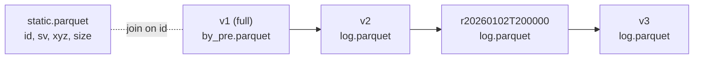

# Synapse snapshot format

> **Status: experimental.** This describes the format written by the
> [aedes](https://github.com/flyconnectome/aedes) R package (manifest format
> 2). It may change.

A synapse snapshot is a local, versioned copy of the root ids of every synapse
in a CAVE synapse table. Together with the CAVE chunkedgraph it can answer
queries at any time, including now, without querying the synapse table.

## Model

The data are split by how often they change.

| Part | Contents | Changes | Size (order of magnitude, ~10⁸ synapses) |
|---|---|---|---|
| Static | synapse id, pre and post supervoxels, positions, size | never | written once |
| Full snapshot | root ids of every synapse at one time | rarely rebuilt | a few GB with the static data |
| Checkpoint | synapses whose roots changed since its parent | daily and at each version | ~1 MB per day |

A checkpoint's rows are its base full snapshot updated by the logs of every
checkpoint between them. Root ids are never reused, so each log row is a fact:
"at time `t` this side of synapse `id` had root `r`". Reading a checkpoint
takes the latest value of each side.



## Layout

A snapshot folder holds one static file and one subfolder per snapshot *tag*.
Tags are `v<N>` for a materialization version and `rYYYYmmddTHHMMSS` for a
regular checkpoint. All parquet files are zstd-compressed. Root and supervoxel
ids are signed 64-bit integers (BIGINT).

| Path | Columns | Sort |
|---|---|---|
| `static.parquet` | `id` INTEGER, `pre_sv`, `post_sv` BIGINT, `pre_x`, `pre_y`, `pre_z`, `post_x`, `post_y`, `post_z`, `size` INTEGER | `id` |
| `static.json` | row count and build time | |
| `<tag>/by_pre.parquet` | `pre_root`, `post_root`, `id` (full snapshots only) | `pre_root, id` |
| `<tag>/by_post.parquet` | the same rows (optional) | `post_root, id` |
| `<tag>/log.parquet` | `id`, `t` TIMESTAMP, `pre_root`, `post_root`, `old_pre`, `old_post` (checkpoints only) | `id` |
| `<tag>/meta.json` | see below | |

- `id` is the synapse id of the CAVE synapse table.
- Positions are integer voxel coordinates.
- Sorting the root files by root lets DuckDB skip row groups when filtering by
  root, so a query for thousands of neurons takes seconds. `by_post.parquet`
  only speeds up queries for inputs.
- The md5 of `static.json` identifies the static data. Clients refuse to mix
  snapshots built from different static files.

### Log rows

- One row per synapse with at least one changed side.
- `t` is the checkpoint's time, the same for every row in the file.
- Only a side that changed is filled in; the other is NULL. A row never has
  both sides NULL.
- `old_pre` and `old_post` are that side's roots at the parent. Reading a
  snapshot does not need them, but they allow checks and going back in time.

### meta.json

Written last: its presence marks a finished snapshot.

| Field | Meaning |
|---|---|
| `tag` | the folder name |
| `timestamp` | UTC text with microseconds, e.g. `2026-10-06 14:12:03.123000 UTC`. Version checkpoints use the version's exact time; others are whole milliseconds. |
| `base` | tag of the full snapshot it builds on; absent or null for a full snapshot |
| `parent` | tag of the snapshot its log is relative to (the base or another checkpoint); always older |
| `kind` | `version`, `regular` or `local` |
| `version` | the materialization version, if any |
| `rows` | number of log rows |

`local` checkpoints are made by clients for their own use, without waiting for
edits to settle (see [late-visible edits](#late-visible-edits)). They are never
published, and never used as a starting point for later times.

## Chain rules

1. A checkpoint's chain is found by following `parent` back to `base`.
2. Every snapshot in the chain must have the same `base`. A checkpoint whose
   chain is missing or inconsistent is not usable.
3. A checkpoint can be made into a full snapshot ("rebased") by writing
   `by_pre.parquet` and removing `base` from its meta. Its log is kept but no
   longer read.

## Rows at a checkpoint

This SQL defines the content of a snapshot. `LOGS` is the list of
`log.parquet` files in its chain. For a full snapshot it is just the base
file.

```sql
SELECT b.id,
       coalesce(f.pre_root,  b.pre_root)  AS pre_root,
       coalesce(f.post_root, b.post_root) AS post_root
FROM read_parquet('<base>/by_pre.parquet') b
LEFT JOIN (
  SELECT id,
    arg_max(pre_root,  t) FILTER (WHERE pre_root  IS NOT NULL) AS pre_root,
    arg_max(post_root, t) FILTER (WHERE post_root IS NOT NULL) AS post_root
  FROM read_parquet(LOGS)
  GROUP BY id
) f USING (id)
```

For details (positions, supervoxels), join `static.parquet` on `id`.

## Times after the newest checkpoint

A query at time *T* after the newest published checkpoint (time *t0*) starts
from that checkpoint and applies the edits since. Only supervoxels are ever
mapped to new roots; root ids are never translated directly.

1. `chunkedgraph.get_delta_roots(t0 - overlap, T + 1 ms)` gives the roots that
   expired. CAVE counts edits before `timestamp_future`, but a root lookup at
   *T* already sees an edit made exactly at *T*, hence the extra millisecond.
2. Find the synapses with either side on an expired root.
3. Look up the supervoxels of those sides with
   `chunkedgraph.get_roots(sv, timestamp=T)`.
4. The result is the checkpoint rows minus those ids, `UNION ALL` the
   looked-up rows.

The aedes R client caches this per session and, for small queries, updates
only the query's own rows instead. Both are optimisations; the steps above are
the whole algorithm.

### Late-visible edits

CAVE lists each edit with the time it was made, but the listing can lag,
usually by seconds and occasionally by minutes. Reading edits up to a very
recent time can miss some, and anything built from that point keeps missing
them. So:

- A published checkpoint is only made once its time is at least an hour old.
- Every update re-reads edits from `overlap` (600 s) before its starting time.
- Local checkpoints are never used as a starting point for later times.

## Publishing

The published folder holds the same files plus `manifest.json`:

| Field | Meaning |
|---|---|
| `format` | 2 |
| `created` | publication time |
| `latest` | newest tag |
| `snapshots` | table of `tag`, `timestamp`, `base`, `parent`, `kind`, oldest first, full snapshot first |
| `files` | table of `path`, `size`, `md5`, `mtime` |
| `keep` | files from the previous manifest that are still served |

- Files are placed by rename, and the manifest is written last.
- Files listed only by the previous manifest stay for one more round, so a
  client that has just read it can finish downloading.
- Clients download `static.parquet` and `static.json` first, then each
  snapshot after its parent. They check every md5, never change a tag they
  already have, and place each `meta.json` last.

The address of the aedes publication is derived at run time from the aedes
CAVE datastack (see `aedes_snapshot_url()` in aedes). It is deliberately not
written here.
